# Café Management Desktop Application

This is a cross-platform desktop application developed for managing café operations, built using C# MAUI with a focus on providing a user-friendly interface for staff. The application enables managing multiple coffee and add-in items, generates sales reports, and includes membership management for discounts.

## Features

- **Cross-Platform Desktop Application**: Developed using C# MAUI, providing compatibility across different operating systems (Windows, macOS, etc.) with a responsive and user-friendly interface.
  
- **Password Protection**: Secure system for modifying prices of coffee and add-ins, ensuring only authorized users can make changes.

- **Item Management**: Add, update, and remove coffee items and add-ins with seamless data storage and restoration through JSON files.

- **Membership Management**: Manage membership discounts and benefits for loyal customers.

- **Sales Reports**: Generate detailed daily and monthly sales reports, including transaction summaries and most purchased items.

- **Data Manipulation with LINQ**: Efficient data handling and manipulation using LINQ, improving the performance and scalability of the application.

- **Dynamic UI with MUD Blazor**: Integrated MUD Blazor for creating dynamic user interface components, enhancing user interaction.

## Technologies Used

- **Framework**: C# MAUI (for cross-platform compatibility)
- **UI Library**: MUD Blazor (for dynamic components)
- **Data Storage**: JSON file for storing and restoring café items and settings
- **Data Querying**: LINQ (for efficient data querying and manipulation)
- **Security**: Password-protected features for price modification

## Screenshots
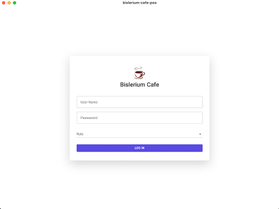
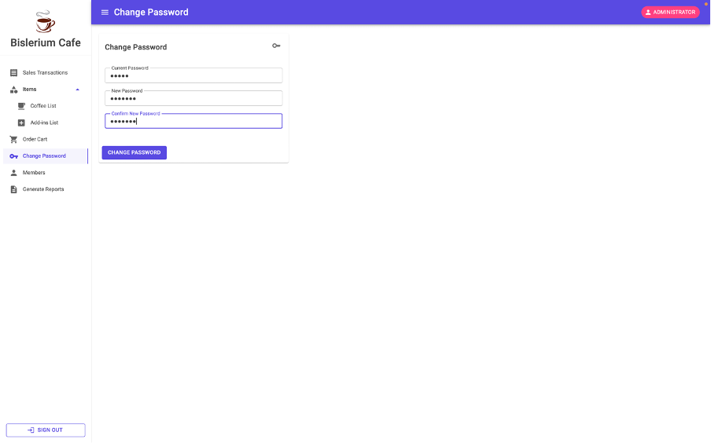
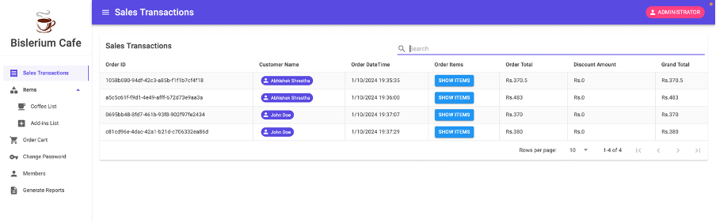
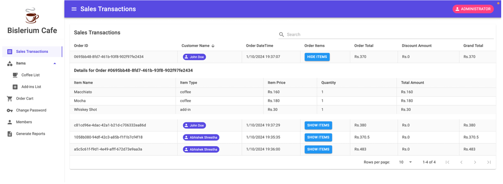
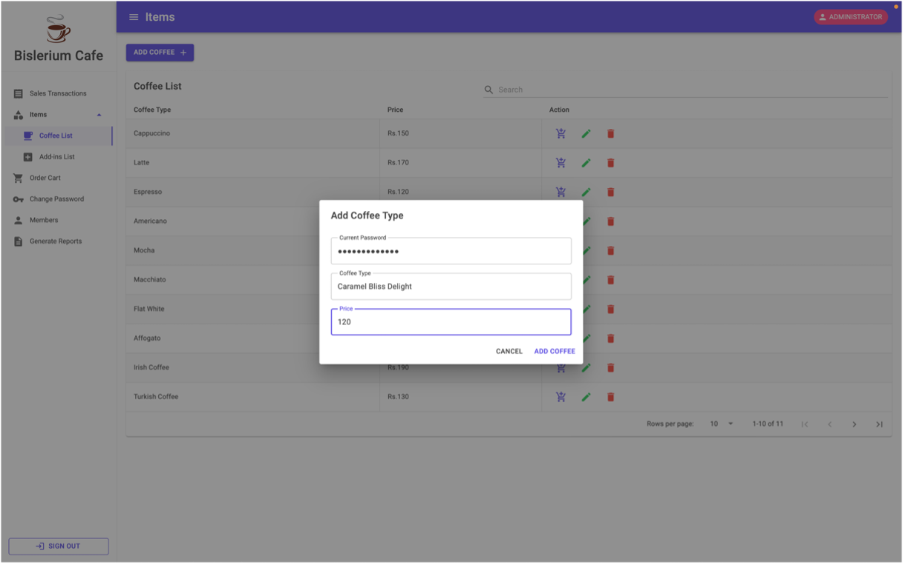
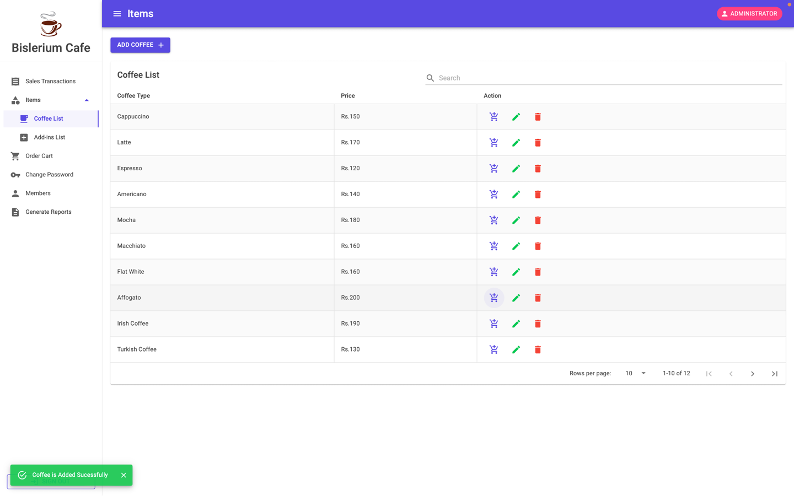

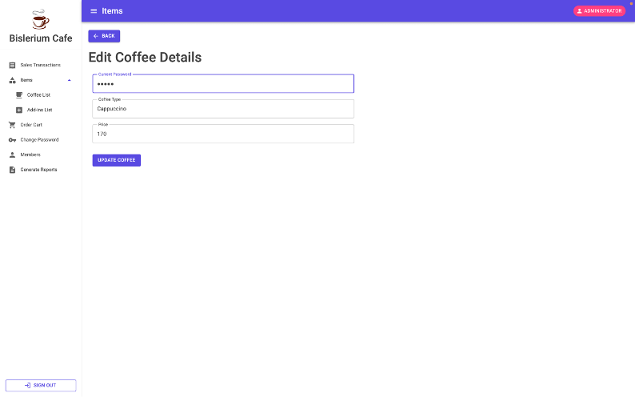
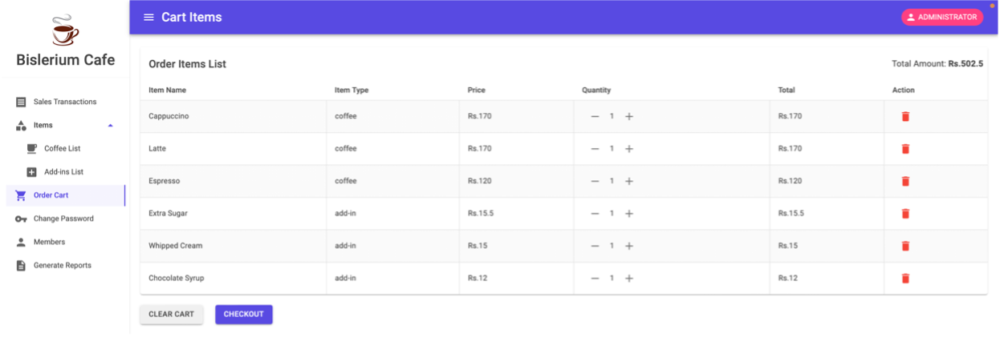
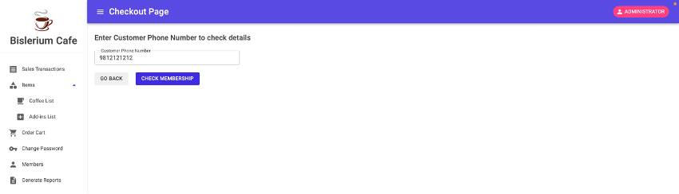
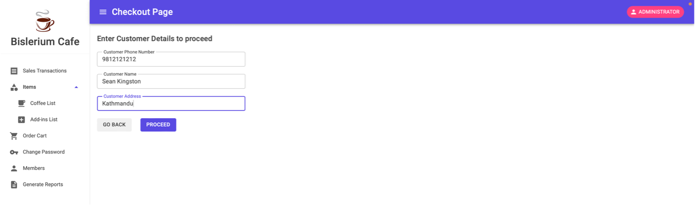
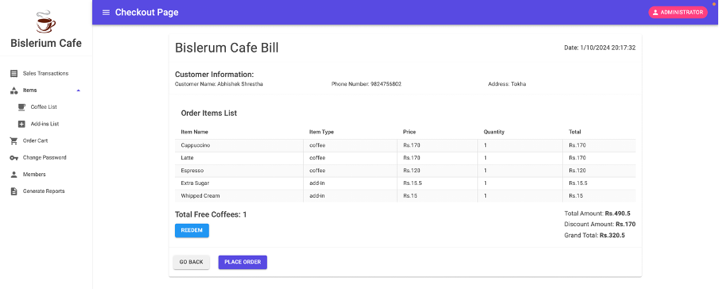
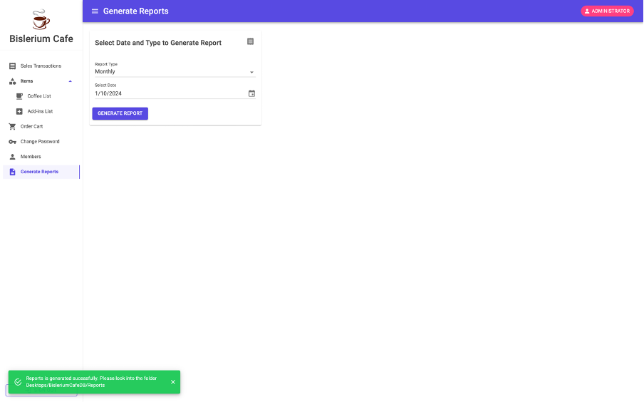
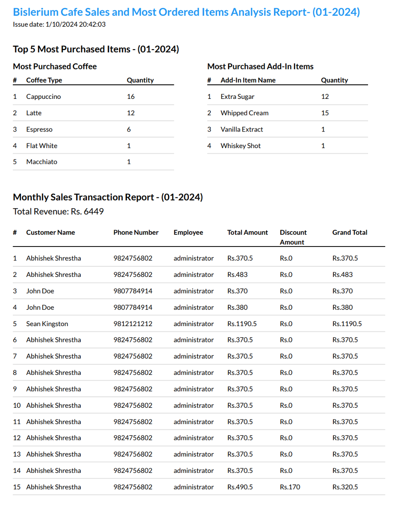

